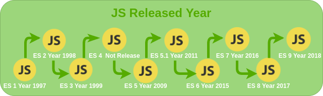
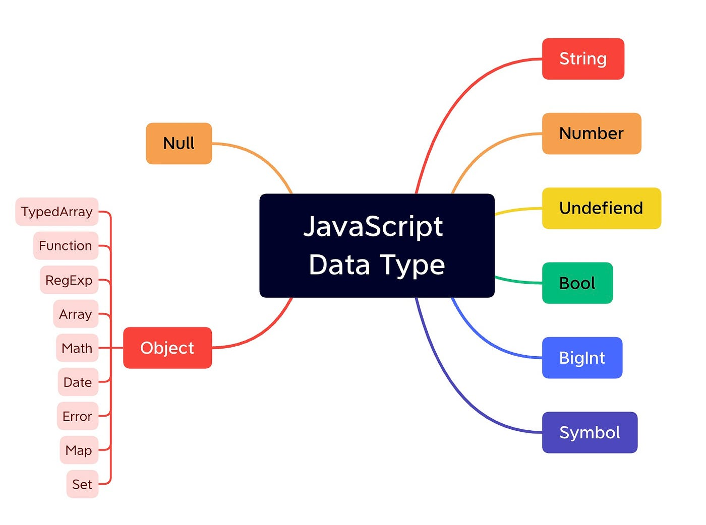

###

###### Variables

1. var- Old version
2. let- ES6
3. const- ES6

###### Data Types

### Primitive

1. "String"
2. number
3. Boolean
4. Symbol
5. null
6. undefined
7. Biginteger

### Non-primitive, complex or reference type

1. object

### Scopes

