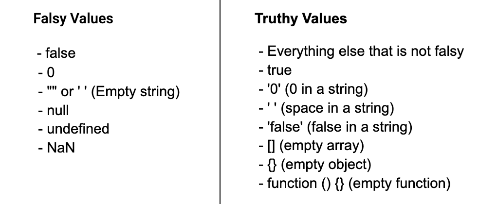
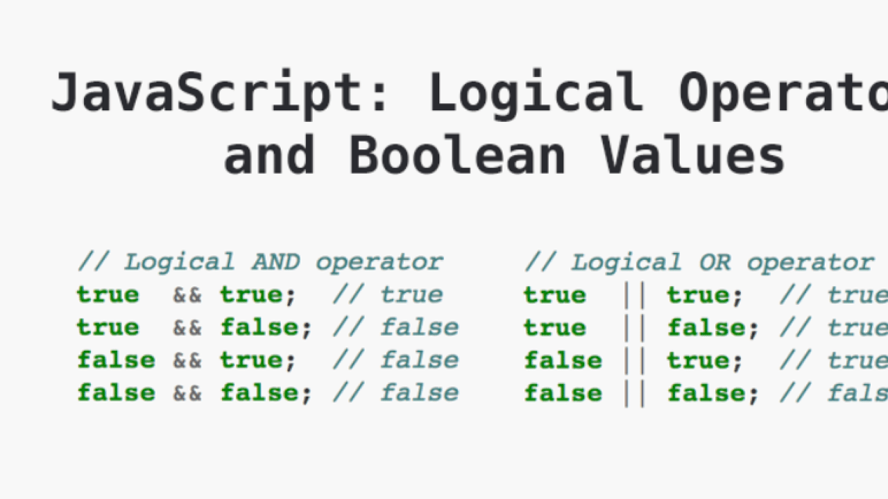
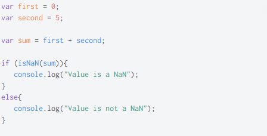
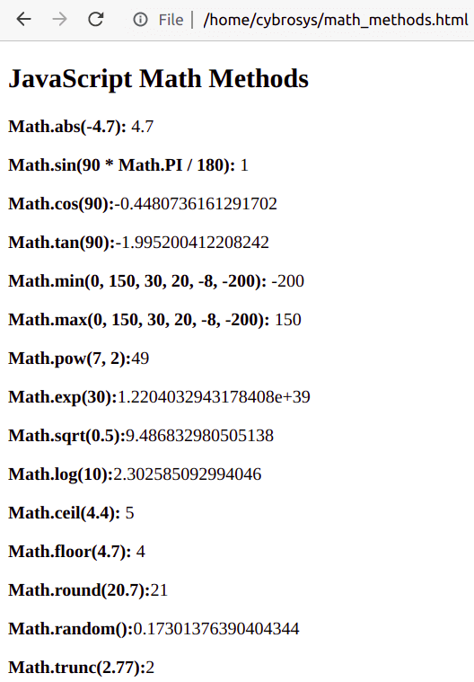
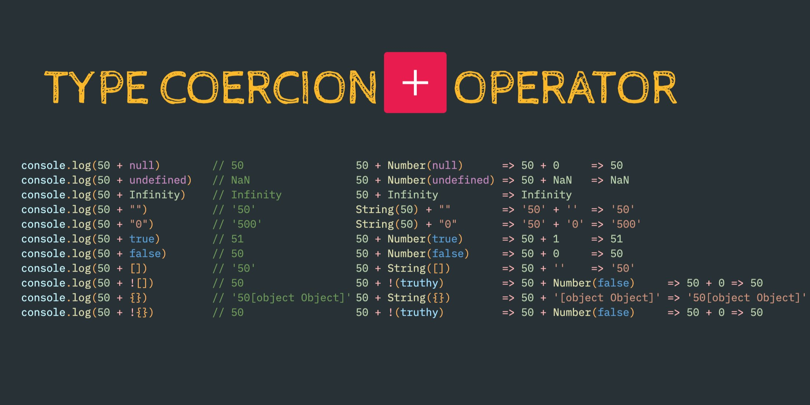

###### lesson 2

### Complex data types

### Math object

### Number constructor, methods and properties

### Type conversion, type coercion

### If, else condition operators

### Nullish values, isNaN

### Booleqn constructor

### Truthy and Falsy

### Logical operators

### Ternary operator

